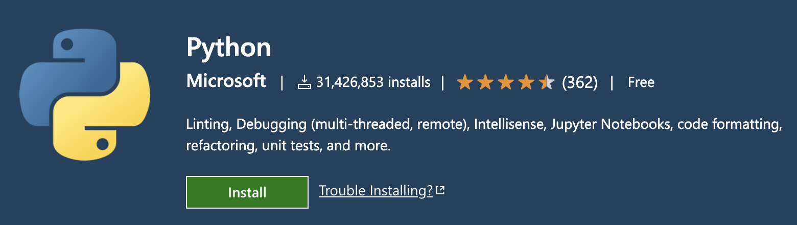
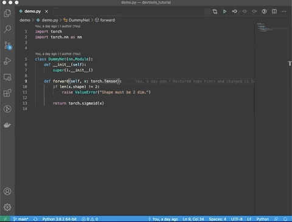
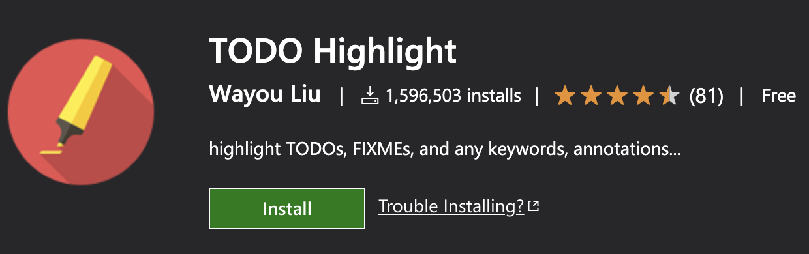
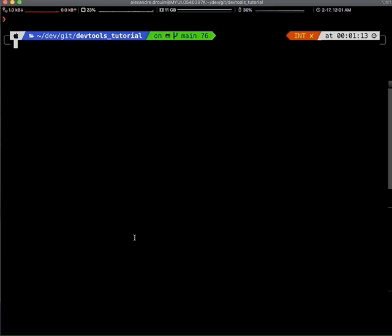

  <iframe width="560" height="315" src="https://www.youtube.com/embed/XnHjatTco_0" frameborder="0" allow="accelerometer; autoplay; clipboard-write; encrypted-media; gyroscope; picture-in-picture" allowfullscreen></iframe>

<a href="#git--github">[git/github]</a>&nbsp;<a href="#visual-studio-code">[vscode]</a>&nbsp;<a href="#flake8">[flake8]</a>&nbsp;<a href="#pytest">[pytest]</a>&nbsp;<a href="#makefiles">[makefiles]</a>&nbsp;<a href="#docker">[docker]</a>&nbsp;<a href="#circleci">[circleci]</a>

This repositority contains a list of software development tools that I find useful for collaborative projects. I have used them for both academic and industrial projects. I hope that you will find these resources useful and that you will try to apply them in the context of your course project.

**NOTE: THIS IS STILL A DRAFT. MORE CONTENT WILL BE ADDED SOON*

# Coding

## Git + GitHub

[Git](https://en.wikipedia.org/wiki/Git) is a source code management tool that allows a group of people working collaboratively to track changes to a set of files (e.g., code). When working with Git, code is stored in *repositories*. [GitHub](https://github.com/) is a website that hosts Git repositories. In fact, this tutorial is hosted on GitHub via [GitHub Pages](https://pages.github.com/).

* [Tutorial: basics of git and GitHub](https://product.hubspot.com/blog/git-and-github-tutorial-for-beginners)
* [Collaborating with GitHub](https://guides.github.com/introduction/flow/)

## Visual Studio Code

Visual Studio Code (vscode) is a lightweight IDE developped by Microsoft. It supports multiple programming languages and file types via a plugin system.

[[Introduction]](https://code.visualstudio.com/docs/introvideos/basics)

### Live sharing

This awesome functionality of vscode allows multiple people to code collaboratively in real time (à la Google Docs). You may find this extremely useful when showing off a new functionality to your colleagues or to do remote pair programming. [[More details]](https://visualstudio.microsoft.com/services/live-share/)

### Plugins

Here is a list of the plugins I use the most:

#### Python

A Visual Studio Code extension with rich support for the Python language (for all actively supported versions of the language: >=3.6), including features such as IntelliSense, linting, debugging, code navigation, code formatting, Jupyter notebook support, refactoring, variable explorer, test explorer, and more!
[[More details]](https://marketplace.visualstudio.com/items?itemName=ms-python.python)

#### GitLens

Supercharge the Git capabilities built into Visual Studio Code — Visualize code authorship at a glance via Git blame annotations and code lens, seamlessly navigate and explore Git repositories, gain valuable insights via powerful comparison commands, and so much more.
[[More details]](https://marketplace.visualstudio.com/items?itemName=eamodio.gitlens)

#### IntelliCode

IntelliCode saves you time by putting what you’re most likely to use at the top of your completion list. IntelliCode recommendations are based on thousands of open source projects on GitHub each with over 100 stars. When combined with the context of your code, the completion list is tailored to promote common practices. [[More details]](https://visualstudio.microsoft.com/services/intellicode/)

#### TODO Highlight

Highlight TODO, FIXME and other annotations within your code. [[More details]](https://marketplace.visualstudio.com/items?itemName=wayou.vscode-todo-highlight)

I also like to combine this one with the [TODO Tree](https://marketplace.visualstudio.com/items?itemName=Gruntfuggly.todo-tree) extension.

# Python Development

## Flake8

Flake8 is a Python library that wraps PyFlakes, pycodestyle and Ned Batchelder’s McCabe script. It is a great toolkit for checking your code base against coding style (PEP8), programming errors (like “library imported but unused” and “Undefined name”) and to check cyclomatic complexity. -- [[source](https://simpleisbetterthancomplex.com/packages/2016/08/05/flake8.html)]

[[Documentation]](https://flake8.pycqa.org/en/latest/index.html#quickstart)

## Pytest

Pytest is a tool for unit testing in Python that is very simple to use ([Documentation](https://docs.pytest.org/en/stable/contents.html), [Tutorial](https://realpython.com/pytest-python-testing/)).

# Other

## Makefiles

A makefile consists of a set of rules (referred to as targets) that can be run using the `make target_name` command. Each target can have dependencies and is only rerun if these have changed. 

Take a look at the [example makefile](./makefile) provided with this tutorial. You will see that there are four targets. The first two produce log files for flake8 and pytest and will only be executed if the Python code files in the `demo` directory have changed. The `logs.zip` target depends on the log files and produces a zip file that contains the logs. Note that, in the example below, I run each target separately, but running `make logs.zip` would have autmatically run all its dependencies.

[[Tutorial](https://makefiletutorial.com/)]

## Docker

TODO

## CircleCI

CircleCI is a [continuous integration](https://en.wikipedia.org/wiki/Continuous_integration) (CI) tool that is free to use with public Git repositories. Basically, CI tools enable you to run a series of commands each time changes to the code are pushed to GitHub. 

Take a look at the [example configuration](https://github.com/aldro61/devtools_tutorial/blob/main/.circleci/config.yml) file that is provided with this tutorial. Many comments were included to help you understand each part. When code is pushed, CircleCI will automatically pull the latest version of the code, run unit tests using [pytest](#pytest), and run code style verifications with [flake8](#flake8). Moreover, these steps will be run in Python 3.7 and 3.8 environments.

You can view the status of CI checks beside each commit in the commit history. It is even possible to prevent merging pull requests until all checks have passed.

Notice how the CircleCI runtime environment is simply a Linux machine in which you can install any dependency. For example, the Python 3.8 example also installs the `wget` command using `apt-get install`. In fact, in the example, we configure CircleCI to use a [Docker](#docker) image that comes with Python preinstalled (e.g., `cimg/python:3.8`). You could specify another image based on your needs (e.g., a Docker image tailored to your project).

Finally, for any repository in which CircleCI is used, you can get a status badge that indicates the "build status". This may indicate "failed" if, e.g., your unit tests failed.

