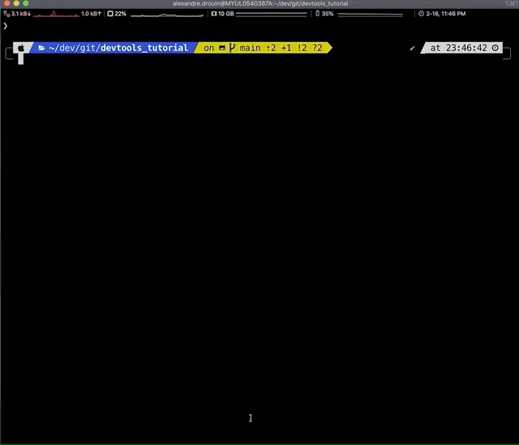

  <iframe width="560" height="315" src="https://www.youtube.com/embed/XnHjatTco_0" frameborder="0" allow="accelerometer; autoplay; clipboard-write; encrypted-media; gyroscope; picture-in-picture" allowfullscreen></iframe>

This repositority contains a list of software development tools that I find useful for collaborative projects. I have used them for both academic and industrial projects. I hope that you will find these resources useful and that you will try to apply them in the context of your course project.

**NOTE: THIS IS STILL A DRAFT. MORE CONTENT WILL BE ADDED SOON*

# Coding

## Git + GitHub

* [Tutorial: basics of git and GitHub](https://product.hubspot.com/blog/git-and-github-tutorial-for-beginners)
* [Collaborating with GitHub](https://guides.github.com/introduction/flow/)

## Visual Studio Code

Visual Studio Code (VS Code) is a lightweight IDE developped by Microsoft. It supports multiple programming languages and file types via a plugin system.

[Introduction](https://code.visualstudio.com/docs/introvideos/basics)

### Live sharing

An awesome functionality that allows multiple people to code collaboratively in real time (à la Google Docs). You may find this extremely useful when showing off a new functionality to your colleagues or to do remote pair programming. [[More details]](https://visualstudio.microsoft.com/services/live-share/)

### Plugins

Here is a list of the plugins I use the most:

#### Python

[More details](https://marketplace.visualstudio.com/items?itemName=ms-python.python)

#### GitLens

[More details](https://marketplace.visualstudio.com/items?itemName=eamodio.gitlens)

# Python Development

## Flake8

Flake8 is a tool that will check you Python code's style and report any issues ([Documentation](https://flake8.pycqa.org/en/latest/index.html#quickstart)).

## Pytest

Pytest is a tool for unit testing in Python that is very simple to use ([Documentation](https://docs.pytest.org/en/stable/contents.html), [Tutorial](https://realpython.com/pytest-python-testing/)).

# Other

## Makefiles

A makefile is a file that serves to automate the execution of multiple commands. Groups of commands, referred to as *targets* are named and can be invoked with a `make <name>` command. Moreover, targets may have dependencies and will only be re-executed if these dependencies have changed. For example, in the [example makefile](./makefile) provided with this tutorial, there are four targets. The first two produce log files for flake8 and pytest and will only be executed if the Python code files in the `demo` directory have changed. The `logs.zip` target depends on the log files and produces a zip file that contains the logs. Finally, the `clean` target cleans up the log files and keeps only the zip file.

[[Tutorial](https://makefiletutorial.com/)]

## Docker

## CircleCI

